[TOC]

## 基础

- 介绍一下渲染管线越详细越好？这个问题出现的频率是最高的、基本上各种公司技术面都能碰到因此需要好好回答一下。同时在回答问题的时候也有一些小技巧，你可以在介绍渲染管线的时候多回答一些你知道的内容，引起面试官的兴趣，这样他就会继续问下去。我讲一下我一般会回答哪些内容：vertex shader中传入顶点法线等信息，经过MVP变换后传递到下一个阶段，后续会经历两个可选的着色器（tessellation shader和geometry shader），同时简单介绍一下相应的内容。接下来就是在裁剪空间进行裁剪，后面除以w到NDC空间，再到光栅化阶段、在光栅化阶段可以介绍一下在这部分能做的MSAA抗锯齿等、接下来到fragment shader，在里面进行一些着色（根据自己的知识点掌握展开），再后面就是深度缓存、模板测试、alpha blend的一些操作。同时可能还会问一些如early-z是什么解决了什么问题，什么时候会失效等这些可以一并讲出来。米哈游面试官还问了是否知道forward+。
- 介绍一下延迟渲染及其优缺点？这个问题的频次是仅次于上一个的、一定要完整了解一遍延迟渲染是如何实现的，gbuffer如何存储，解决了哪些问题，以及优缺点，什么时候会失效等。同样了解的越详细越好。
- 介绍一下抗锯齿有哪些方法？SSAA,MSAA,TAA,FXAA等。要了解原理，并且能完整的讲出来。
- alpha blend的方向？从远到近。以及和early-z等方法的冲突。
- 法线贴图的相关概念？为什么是偏蓝的、法线空间到世界坐标的变换计算等。
- 了解游戏中的贴花是如何实现的？（雷火提前批）这个最好去查一下代码是如何实现的，大致有两种方法、对forward shading来说可以是在鼠标点击的物体表面产生一个几何体，然后绘制一遍，如果是defered shading则可以生成一个几何体，绘制到相应的gbuffer中（可以是albedo和normal）。
- 介绍一下pbr的材质？这个可以介绍一下微表面模型，以及对应的三个分子中的函数FNG相应的含义。同时还会问金属度影响的是那部分？这部分建议写一下代码自己实现一下才能记得牢。
- 如何在一个三角形中均匀采样,给定一个0,1的随机数产生器？我当时答的是使用三角形中心坐标的u,v对应产生一个点，然后舍掉在三角形外的点，面试官又问我能不能有不丢弃点的方法，然后没答出来。
- 空间中两个三角形求交、平面中两个三角形求交？回答完这个问题后，后续的问题是平面中多个三角形求交如何设计相应的数据结构进行加速。
- 介绍一下如何构建场景的BVH？同时有问空间划分的其他一些数据结构八叉树等，并说出他们的区别。
- 如何实现重要性采样？（米哈游提前批）包括光源和各种材质。
- 实时渲染的阴影算法？PCF,PCSS等具体实现。
- 介绍一下IBL及其具体实现？这部分问的也非常多，雷火、字节、腾讯都有问到。涉及到不同材质的IBL如何生成以及如何使用，建议细看。
- 如何提高实时渲染的质量？对于静态场景可以用光照烘焙等预计算方法将光照信息烘焙到纹理中，如果是动态场景，可以使用光线探针。腾讯还问了个问题就是，如果我的阴影是用光照烘焙来做的，那么当一个移动的物体经过这块阴影的时候如何让阴影在动态物体上体现出来。
- 介绍一下MIPMAP？这个要讲清楚MIPMAP解决的问题是什么，以及摩尔纹等现象的原理。
- 游戏中如何实现点选物体的功能？我知道的有两个方法，一个是使用光线投射的方法，通过屏幕上的点求出其相应的世界坐标（2维的点其实对应的是三维的一条线，因此随便求线上一个点就行，z坐标置1）然后又知道相机的世界坐标，这样可以做光线求交。另一个方法是多准备一个framebuffer，给每个面片都hashmap一个index对应的颜色，比如32位的index每8位分开作为RGBA。然后读取屏幕上对应framebuffer上的颜色就行。（可以在点触的时候绘制一遍即可）。
- 是否了解骨骼动画的实现？这部分属于了解了更好的，最好可以用ue4跑几个demo学学。雷火问了我如何对两个骨骼动画帧进行插值。
- 如何测试渲染流程中的瓶颈？腾讯。
- 角色压到草后草弯曲是如何实现的？草都对应的是同一个instance，因此不能直接改变顶点坐标等。（互娱）
- 离角色很近的地方的树叶是如何渲染保持性能的？（互娱）先问了渲染大片的树如何保证效率，我说了LOD的方法，然后他问了我近处的，例子是角色爬树。
- 大世界渲染的场景管理方法？（雷火主管面）这部分可以知乎上搜一些文章了解一下。
- 是否又了解的GPU框架简单介绍？这个我推荐下面这篇文章讲的非常好。[深入GPU硬件架构及运行机制 - 0向往0 - 博客园](https://link.zhihu.com/?target=https%3A//www.cnblogs.com/timlly/p/11471507.html%2351-cpu-vs-gpu)

### 介绍一下渲染管线越详细越好

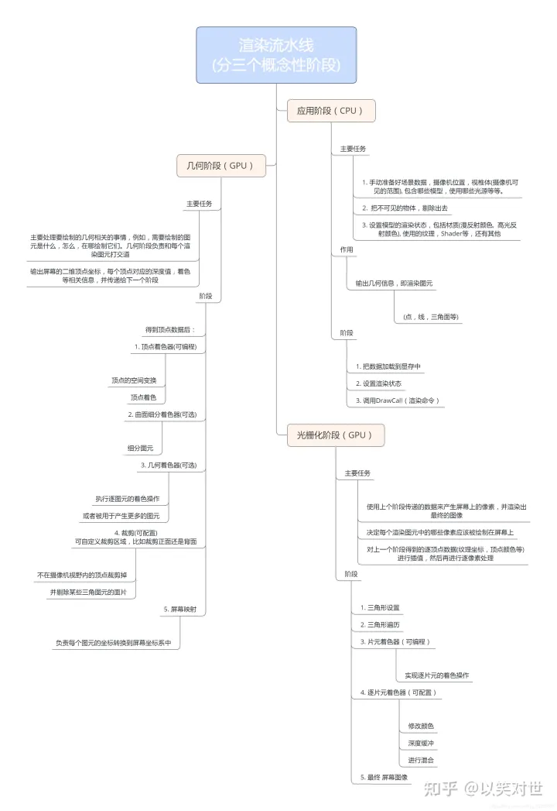

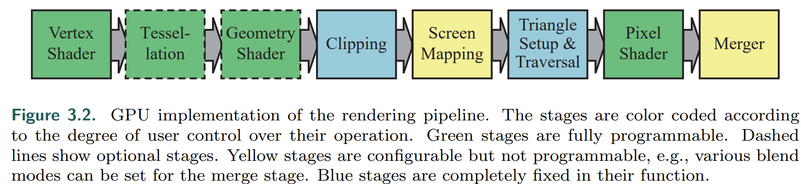

(RTR4 P43)

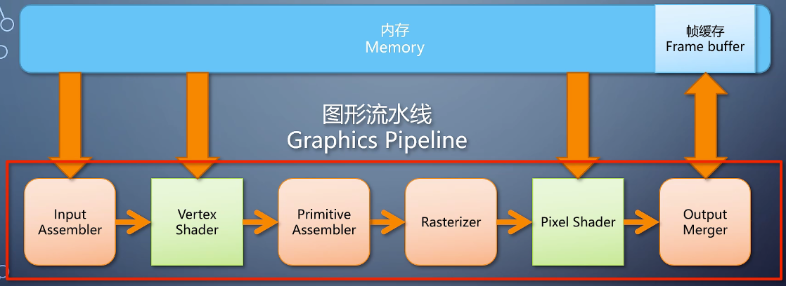

(上帝视角看GPU)

(上帝视角看GPU)

#### input assembler

根据输入的顶点属性数据（buffer）获取各个顶点的坐标、法线、UV等信息

#### vertex shader

主要对输入顶点的属性进行一些操作。在这一部分可以将模型投影到裁剪空间（homogeneous clip space，透视投影之后透视除法之前的坐标空间）。vertex shader输出顶点的坐标、法线、纹理坐标等。蒙皮动画和基于高度图的地形系统也是在这一部分实现。

#### primitive assembler

根据顶点数据以及各个三角形的顶点索引组装三角形

#### tessellation

曲面细分

#### geometry shader

复制物体

创建cascaded shadow map

#### clipping

在其次裁剪空间中进行，也就是经过MVP矩阵之后，除以 $w$ 之前（此时可见区域还是一个锥体，除以 $w$ 之后才会变成立方体）。

裁剪的主要作用：由于只有视锥体内部的内容需要渲染，所以将其外部的三角面剔除。另外，如果一个顶点处于摄像机之后，那么除以 $w$ 会导致该顶点的位置转换到摄像机前，与正确结果不符。

裁剪的过程：将三角形与视锥体的六个面逐个进行裁剪，且上一次裁剪的输出是下一次裁剪的输入。注意裁剪是在四维空间中进行而不是三维，而视锥体的六个面在四维空间中的表达式为：

推导过程见[计算机图形学补充2：齐次空间裁剪(Homogeneous Space Clipping) - 知乎 (zhihu.com)](https://zhuanlan.zhihu.com/p/162190576)

#### rasterizer

光栅化，根据重心坐标对属性进行插值

##### 透视矫正插值

opengl中默认使用。经过透视投影的顶点，其深度经过非线性变化，不能直接使用屏幕空间中求得的重心坐标对顶点的属性（如纹理坐标等）进行差值，而是采用透视矫正插值：
$$
f=\frac{af_a/w_a+bf_b/w_b+cf_c/w_c}{a/w_a+b/w_b+c/w_c}
$$
这里的 $f$ 是顶点属性，$w$ 是顶点经过MVP矩阵后的 $w$ 值，也是顶点经过MV矩阵后，P矩阵前的 $z$ 值，原因如下：

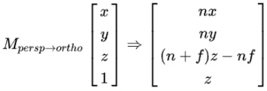

而顶点的深度值由于已经进行过 $1/w$ 的操作，所以直接用屏幕空间的重心坐标进行插值即可

#### pixel shader

逐像素处理

shading在这一部分进行，最终得到每个像素的颜色

### 介绍一下SSAO

#### SSAO

SSAO就是屏幕空间的环境光遮蔽，是一个近似计算全局光照的方法。

环境光遮蔽的主要想法就是假设环境光是常数，假设物体是diffuse材质，同时忽略光的多次弹射，计算光照结果。正确计算环境光遮蔽的方法就是在shading point的上半球面做积分，可以使用蒙特卡洛采样。

SSAO则是仅利用屏幕空间信息来计算环境光遮蔽，主要依靠的就是深度图。因为g-buffer中已经包含了shading point的法线，所以依旧可以在上半球面进行采样。不过此时不使用光线求交来判断各个方向是否有遮挡，而是在上半球内进行采样，将采样点深度和深度图进行比较，如果采样点深度比深度图小，则认为该光线没有受到遮挡。这里需要注意采样点应该是cos weighted的。

前面的AO方法并没有考虑到光的多次弹射，但是也可以用一些方法来近似计算。假设shading point周围区域的颜色都和shading point相同，那么就能得到周围区域所贡献的间接光照。

#### SSDO

关于SSDO，它采用的方法和SSAO有一定的相同之处，都是在上半球内进行采样，只不过SSDO是计算上半球内各个采样点对shading point的间接光照贡献。

### 介绍一下抗锯齿有哪些方法

#### SSAA

每个像素中取多个子采样点进行着色，然后将它们的着色结果进行混合。

是一个比较直接的解决频谱混叠的方法。

计算量非常大。

#### MSAA

同样每个像素包含数个子采样点，但是同一个像素对应的子采样点并不会独立进行shading，只是记录它所属的像素的颜色和深度信息。

GPU内置有MSAA算法。

只能消除几何走样，对着色走样无效果。

不容易用于延迟渲染，因为使用延迟渲染的时候场景会直接被光栅化到g-buffer，如果在这一步骤直接套用MSAA，会混合g-buffer信息而不是shading的结果，这样混合并不完全正确。另外，MSAA会大量消耗内存和带宽，延迟渲染需要存很大的g-buffer，如果再使用MSAA，会有更大的性能压力。

#### FXAA

一个基于后处理的方法。计算亮度来找到边界，然后进行混合 。

使用起来比较方便，而且计算量相对较小。

画面会略有模糊，而且因为是完全基于图像，没有任何的次像素信息，所以在颜色变化较大的部分会比较不稳定。

#### TAA

[主流抗锯齿方案详解（二）TAA - 知乎 (zhihu.com)](https://zhuanlan.zhihu.com/p/425233743)

原理和SSAA相同，但是利用了时间域的信息。在不同的帧选取不同的采样点（实现方法是在投影矩阵上增加偏移，采样使用低差异序列Halton序列），然后在时间域进行混合，混合方式为将当前帧与历史帧进行lerp。TAA需要在非线性空间中进行（线性空间中效果不佳），所以可以在渲染完成之后先转换到非线性空间，完成TAA再转换回线性空间做后处理。对于动态物体，使用motion vector可以得到上一帧它的对应位置的shading point。有时当模型运动、光照变化等情况发生时，历史帧的信息无法得到，所以在和上一帧进行混合之前需要检测颜色的变化，如果颜色变化过大，那么需要将其clamp或clip到这一帧的shading point领域的颜色范围内。

支持延迟渲染，效果较好开销较小。

没有办法用于透明物体，动态场景会出现模糊，且有额外的内存开销。

#### DLSS

后处理方法，基于recurrent CNN，效果好，开销大。

### 实时渲染的阴影算法

#### PCF

主要思路为对visibility进行滤波。对每个shading point，找到它在深度图上的对应位置，在该位置周围进行采样，与shading point的深度进行比较，然后将比较结果取加权平均得到滤波后的visibility。

#### VSSM

Variance soft shadow map。如果直接使用PCF，那么需要在深度图上进行采样，计算量较大。VSSM则用高斯分布来描述深度图上某个区域的深度分布。

如果想要计算滤波后的visibility，只需要知道shading point在深度图上对应位置周围区域的深度的均值和方差。

而任意区域的深度的均值和方差的计算方法为：提前生成两个SAT(summed area table)，其中分别存储深度的累计值和深度平方的累计值，这样就能很快速地计算出深度的均值和方差。

当已经知道shading point的深度和其领域深度的均值和方差时，计算visibility的方法：可以通过高斯分布的累积分布函数（近似计算或查表），也可以套用切比雪夫不等式。

#### 关于Bias

Normal Bias：在左乘变换矩阵变换到对应tile之前，将shading point沿着法线向外移动一段距离，这个距离取决于该shadow map的文素大小（？确认以及为什么？）

#### CSM

...

### 重要性采样

重要性采样是为了在同样采样次数的情况下使蒙特卡洛积分更快收敛，其收敛速度取决于采样分布和被积函数的相关性。由于渲染方程中被积函数未知，所以只能设计采样分布使其形状更接近被积函数。

比较通用的重要性采样方法就是cos weighted采样，这个考虑的就是渲染方程里面的cos项。在预计算irradiance的时候可以使用这个。

对于微表面模型，参照“PBR材质的重要性采样”。

另外，由于直接光光源往往面积较小而且对shading结果贡献很大，可以对光源专门做重要性采样。主要方法就是把 $L_i$ 分为直接光和间接光，直接光就直接在各个光源上采样，这里需要把shading point单位半球面上的积分转换为在光源表面上的积分。

### PBR材质

以UE4为例

用漫反射模型和微表面模型描述材质。对于金属材质，只有specular成分，所以其颜色为微表面模型的菲涅尔系数；对于非金属材质，用微表面模型描述其反射部分，用漫反射模型描述漫射部分，反射部分经常设为base color的4%。若金属度为0到1之间，则线性插值其diffuse和specular比重。

漫反射模型：

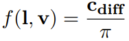

微表面模型：

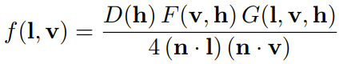

其中 $D$ 项

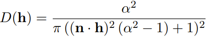

是表面法线分布函数，其中 $\alpha=Roughness^2$。

$G$ 项

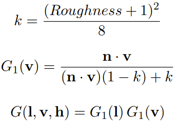

用于描述表面的几何遮挡。这一项只在光源产生的光照中计算，不用在IBL中，否则会导致计算结果偏暗（为什么一般光源就不会变暗？吗？）

$F$ 项

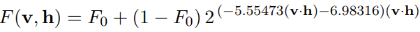

对于金属他就是表面的base_color，对于非金属它的值约为0.04

#### PBR材质的重要性采样

采样分布与被积函数相关性越大，收敛速度越快。假设 $L_i$ 均匀分布，此时渲染方程的被积函数主要受到发现分布的影响，所以可以利用NDF进行重要性采样。

方法为根据NDF随机生成 $\mathbf h$ 向量，然后根据 $\mathbf v$ 计算出 $\mathbf l$，如果 $\mathbf l$ 和法线同向则接受该采样，若不同向则该次采样结果为 $0$

#### IBL

首先使用split sum将光源和brdf项拆开

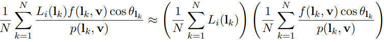

首先对于光源项，如果假设不论 $\mathbf v$ 是什么方向，它所对应的 $\mathbf r$ 的分布都不会变且和垂直入射的情况相同（即$\mathbf v=\mathbf r=\mathbf n$），那么就可以在环境纹理上预计算光源项。预计算的方法就是重要性采样 $\mathbf h$，然后查找其反射光在环境纹理上的值进行平均。这里使用cos-weighted加权平均效果更好。

然后对于brdf项，如果将其中的菲涅尔项拆开，则分别都可以表示为roughness和cos项的函数：

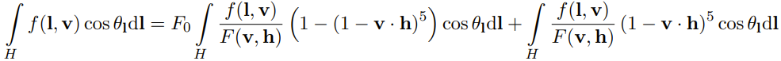

于是可以预计算为一个查找表。

### 法线贴图

法线贴图中存储了切线空间中的法线方向。由于法线方向的z分量存储在蓝色通道中，所以它的值基本在 $(0,0,1)$ 左右，使得法线贴图往往看起来偏蓝

#### 如何建立切线空间

根据三个顶点之间的纹理坐标差异计算切线 $t$ 和副切线 $b$：

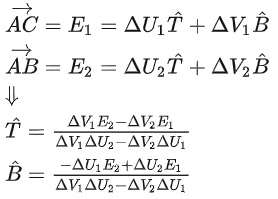

整个三角形使用相同的切线和副切线。在pixel shader中将他们与法线做正交化之后就能得到切线空间

## unity

### instancing buffer和cbuffer

instancing buffer是为了在GPU中实现批量渲染而设计的，用于存储每个实例的独特信息，这些信息通常是每个物体特有的，比如每个物体的位置、旋转、缩放、材质属性等。instancing buffer通常使用顶点缓冲对象（VertexBuffer）来实现。

而cbuffer是一个常量缓冲区，用于存储在渲染期间不变的数据，通常包括光源属性、相机属性、全局设置等。cbuffer通常使用常量缓冲区对象（ConstantBuffer）来实现。

将材质属性放在instancing buffer中的原因是，这些属性通常需要在每个实例中独立地进行修改，而instancing buffer可以为每个实例存储独立的材质属性数据，从而实现批量渲染。

将光源属性放在cbuffer中的原因是，这些属性通常在渲染过程中不变（不同物体使用相同的光源），因此可以将它们存储在一个常量缓冲区中，在渲染每个物体时只需要一次性传递这些常量数据到GPU中，从而减少了数据传输的次数，提高了渲染效率。